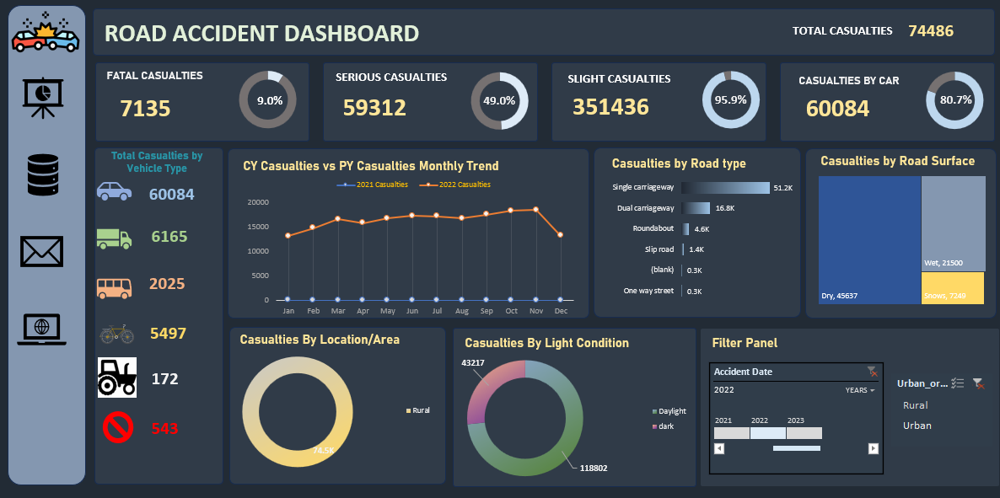
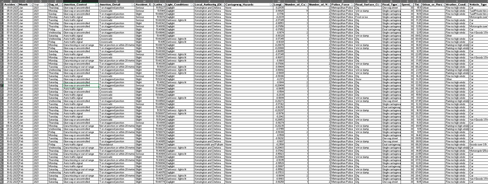
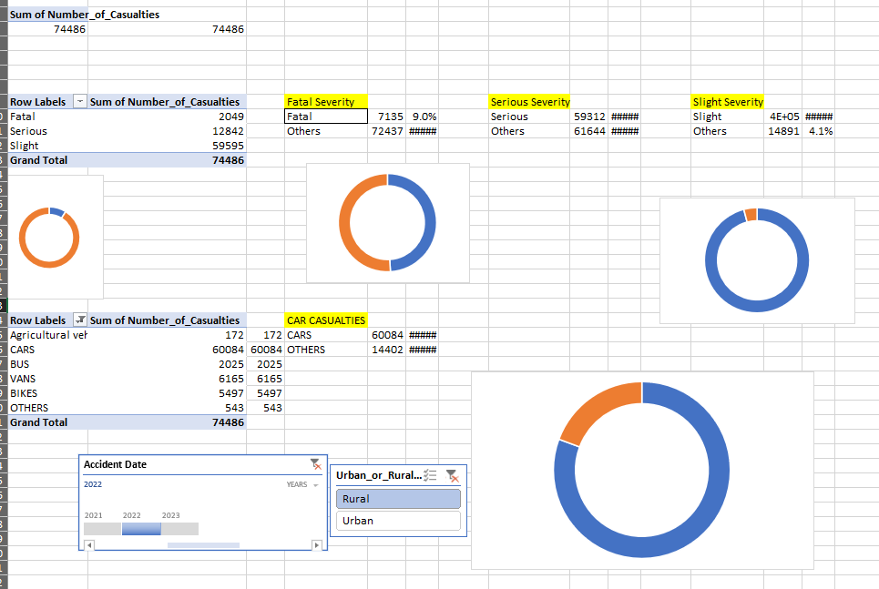
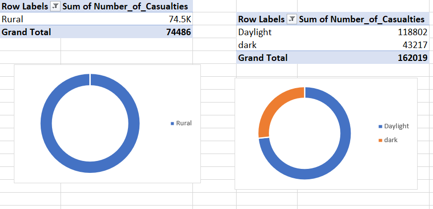

# 🚗 Road Accident Analytics Dashboard

An interactive Excel dashboard analyzing **300,000+ UK road accident records** — built with pivot tables, pivot charts, and slicers to surface casualty trends by vehicle type, road type, surface, lighting, and time.

🎥 **[Watch the demo video](screenshots/demo.mp4)** — see the filters and charts update live

---

## 📌 Overview

Raw accident logs are too large to act on directly. This dashboard turns a 300K-row UK road-safety dataset into a single-page view of casualty severity, vehicle involvement, and road/weather conditions — built entirely with Excel's native tools, no external BI software.

---

## 🎯 Key Features

- **KPI Cards** — Total, Fatal, Serious, and Slight casualties with percentage-of-total rings
- **Vehicle Breakdown** — casualties by Car, Van, Bus, Bicycle, Tractor/Other, Pedestrian
- **YoY Trend Chart** — current vs. previous year casualties, plotted monthly
- **Road Type & Surface** — bar and treemap breakdowns (carriageway type, dry/wet/snow)
- **Location & Light Condition** — Urban/Rural and Daylight/Dark donut charts
- **Live Filters** — slicers for year (2021–2023) and Urban/Rural, updating all charts instantly

---

## 🗂️ Dataset

UK road safety records (STATS19-style schema), ~308,000 rows × 23 columns. Key fields: `Accident_Severity`, `Number_of_Casualties`, `Road_Type`, `Road_Surface_Conditions`, `Light_Conditions`, `Weather_Conditions`, `Vehicle_Type`, `Urban_or_Rural_Area`. Anonymized, no personal data.

---

## 🛠️ Tools & Techniques

Microsoft Excel · Pivot Tables & Charts · Slicers · Calculated KPI fields · Dark-themed custom dashboard layout

---

## 📊 Dashboard Breakdown

**KPI Summary**

**Casualties by Category**

**Monthly & Seasonal Trends**

**Road Type Analysis**

**Underlying Data Analysis Sheet**

---

## 📊 Sample Insights

- Fatal + serious casualties make up a significant share of total incidents
- Single carriageways account for the largest share of road-type casualties
- Most casualties occur on **dry** roads — a reminder that volume, not just weather, drives risk
- Daylight hours show higher casualty counts than dark, likely reflecting traffic volume

---

## ⚠️ Limitations

Excel-based (no live data refresh) · KPI rings are snapshot-based, not fully dynamic · descriptive only, no predictive modeling

## 🔮 Future Improvements

- [ ] Rebuild in Power BI for full-dataset live filtering
- [ ] Add a map visual using Latitude/Longitude
- [ ] Automate cleaning with a Python/Pandas pipeline

---

## 👤 Author

**Afrose Fathima J**
📧 afrosepvt@gmail.com
🔗 [LinkedIn](http://www.linkedin.com/in/afrose-fathima-jamal-492b57291)

⭐ *Star this repo if you found it useful!*
